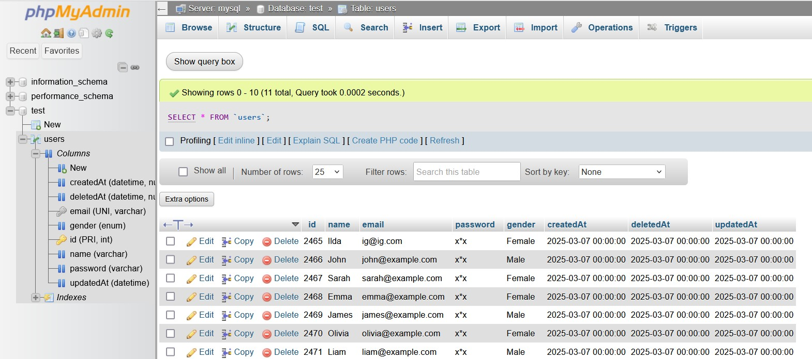

# NodeJS Dev
[Node.js] with focus on building backend with javascript.

## Run app

To run first build the docker image with the Makefile
```bash
make build
```
Once the node-app image is built you can execute the docker compse file:

```bash
docker compose up
```
You can acces port 8080 and perform CRUD operations by using [phpMyAdmin UI](https://www.phpmyadmin.net/). Otherwise, you can also make this operation using API or CLI.
```
POST http://localhost:3000/api/users/add-new-user
```


## References
- [10 Top Node.js Libraries and Tools For Machine Learning](https://www.corbado.com/blog/10-top-nodejs-libraries-machine-learning)
- [11 GitHub Repositories to learn NodeJs](https://shefali.dev/github-repositories-to-learn-nodejs/)
- [JavaScript Stack from Scratch](https://github.com/verekia/js-stack-from-scratch/tree/master)
- [Node.js Project Structure: Best Practices and Example for Clean Code](https://medium.com/@jayjethava101/node-js-project-structure-best-practices-and-example-for-clean-code-3e1f5530fd3b)
